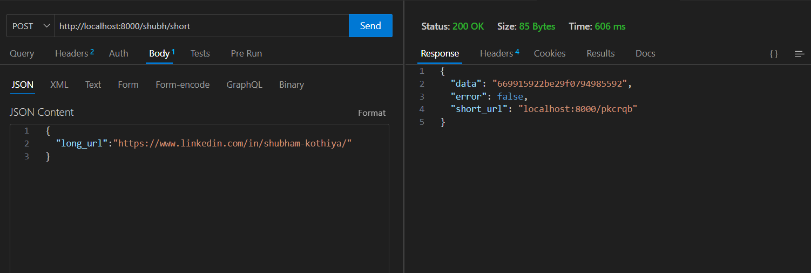

# URL Shortener

urlshortner is a simple and efficient URL shortening service built using Go and the Gin framework. It provides functionality to create short URLs for longer URLs and redirect users to the original URL when accessing the shortened version. Additionally, it supports Docker, making it easy to deploy as a microservice.

## Problem It Solves

- **Simplified URL Sharing:** Long URLs can be cumbersome to share and manage. This service allows users to shorten lengthy URLs, making them easier to share and handle.

## Features

- **Shorten URLs:** Convert long URLs into shorter, more manageable links.

- **Persistent Storage:** Store URLs and their shortened versions in a MongoDB database for reliable access and management.

- **Cross-Platform Compatibility:** Leverages **Go Lang** for broad compatibility across different operating systems.

- **Docker Support:** Creates a Docker image for easy deployment and use as a microservice.

## Installation

#### Follow this commands to test this project

#### 1.Clone the repository:

```
  https://github.com/theshubh007/Url-Shortner

  cd urlshortner
```

#### 2.Install dependencies:

```
  go get go.mongodb.org/mongo-driver/mongo
  go mod tidy
```

#### 3.Set up environment variables:

#### 4.Run the application:

```
  go run main.go
```

or

```
 go build .
./urlshortner
```

## Checkout my docker image:

https://hub.docker.com/repository/docker/shubhamkothiya/urlshortner/general

## Usage:

#### 1.Shorten a URL:

- Send a POST request to "/short" with the long URL in the request body.

```
http://localhost:8000/shubh/short
```

body: format JSON

```parameter
{
  "long_url":"Specify your long URL"
}

```

### Screenshot:



#### 2.Redirect to the original URL::

- Access the shortened URL. For example, http://localhost:8000/shubh/:code, where :code is the unique code generated for the shortened URL.

```
  http://localhost:8000/shubh/pkcrqb
```

## Contributing

Contributions are welcome! Please submit a pull request or open an issue to discuss improvements or features.
